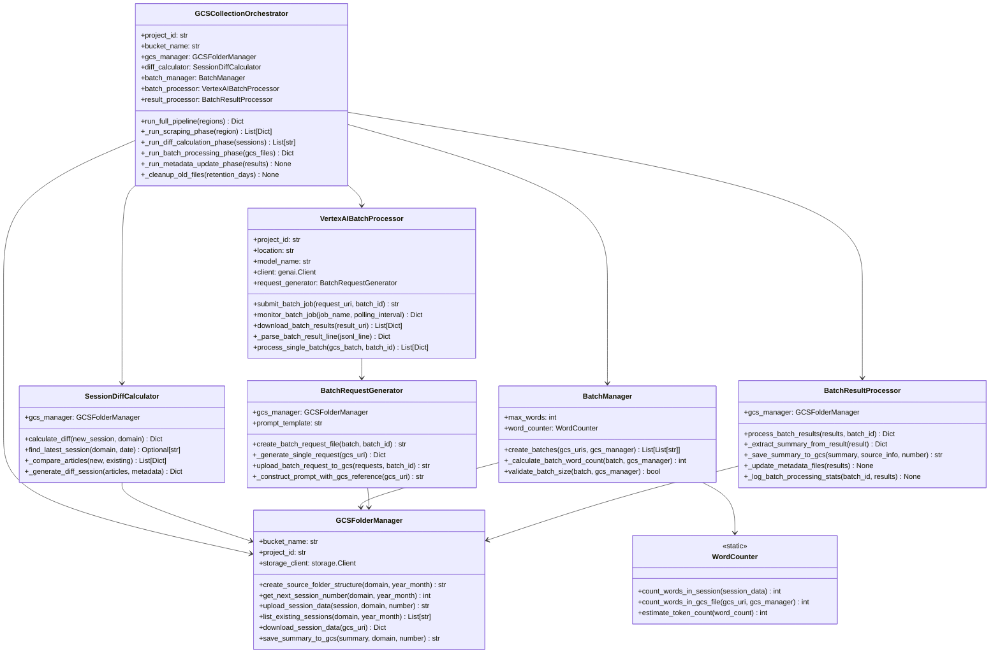
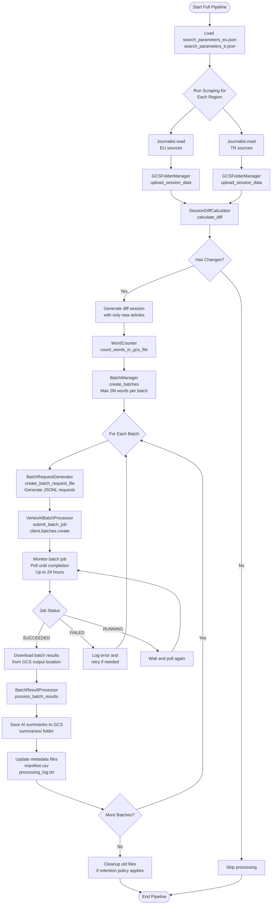
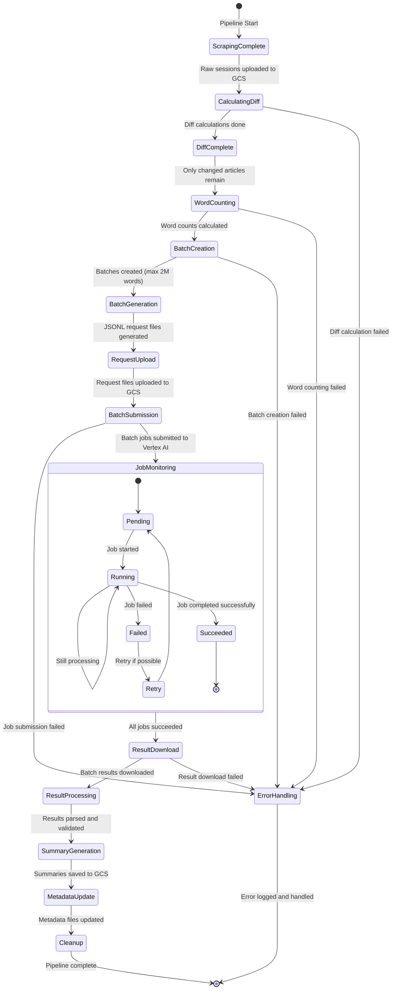
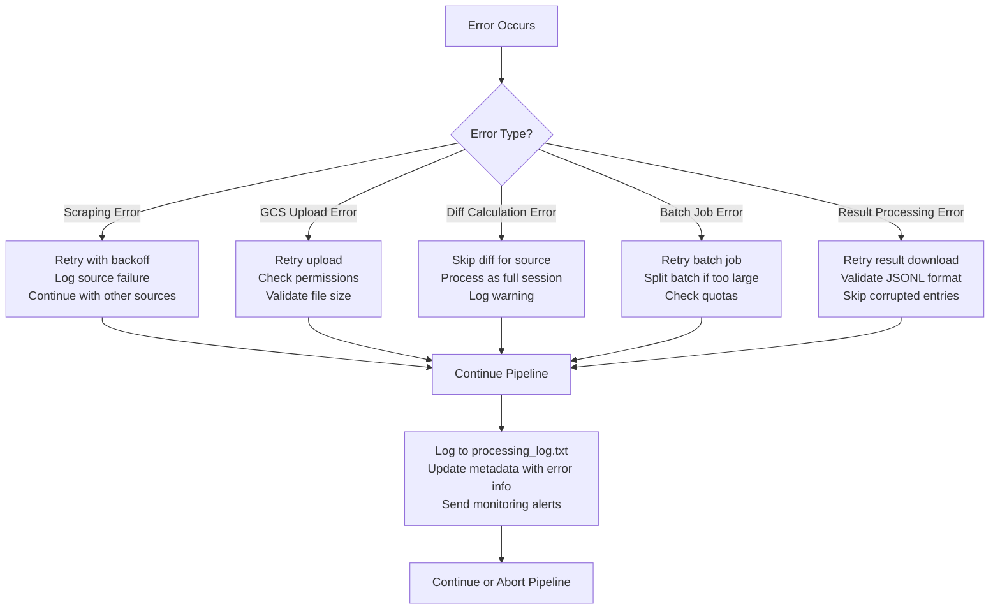

# GCS Batch Integration Architecture Diagrams

## Class Relationship Diagram



## Process Flow Diagram



## Function Call Hierarchy

```mermaid
flowchart TD
    Main[main.py] --> Orchestrator[GCSCollectionOrchestrator.run_full_pipeline]
    
    Orchestrator --> Scrape[_run_scraping_phase]
    Orchestrator --> Diff[_run_diff_calculation_phase]
    Orchestrator --> Batch[_run_batch_processing_phase]
    Orchestrator --> Metadata[_run_metadata_update_phase]
    Orchestrator --> Cleanup[_cleanup_old_files]
    
    %% Scraping Phase
    Scrape --> Journalist[journalist.read]
    Scrape --> GCSUpload[GCSFolderManager.upload_session_data]
    GCSUpload --> CreateStructure[create_source_folder_structure]
    GCSUpload --> GetSessionNum[get_next_session_number]
    
    %% Diff Calculation Phase
    Diff --> CalcDiff[SessionDiffCalculator.calculate_diff]
    CalcDiff --> FindLatest[find_latest_session]
    CalcDiff --> CompareArticles[_compare_articles]
    CalcDiff --> GenDiffSession[_generate_diff_session]
    FindLatest --> GCSList[GCSFolderManager.list_existing_sessions]
    
    %% Batch Processing Phase
    Batch --> CountWords[WordCounter.count_words_in_gcs_file]
    Batch --> CreateBatches[BatchManager.create_batches]
    CreateBatches --> CalcBatchWords[_calculate_batch_word_count]
    CreateBatches --> ValidateBatch[validate_batch_size]
    
    Batch --> GenRequests[BatchRequestGenerator.create_batch_request_file]
    GenRequests --> GenSingleReq[_generate_single_request]
    GenRequests --> UploadRequest[upload_batch_request_to_gcs]
    GenSingleReq --> ConstructPrompt[_construct_prompt_with_gcs_reference]
    
    Batch --> SubmitJob[VertexAIBatchProcessor.submit_batch_job]
    SubmitJob --> ClientBatchCreate[client.batches.create]
    
    Batch --> MonitorJob[monitor_batch_job]
    MonitorJob --> ClientBatchGet[client.batches.get]
    
    Batch --> DownloadResults[download_batch_results]
    DownloadResults --> ParseResultLine[_parse_batch_result_line]
    
    Batch --> ProcessBatch[process_single_batch]
    ProcessBatch --> ProcessResults[BatchResultProcessor.process_batch_results]
    
    %% Result Processing
    ProcessResults --> ExtractSummary[_extract_summary_from_result]
    ProcessResults --> SaveSummaryGCS[_save_summary_to_gcs]
    SaveSummaryGCS --> GCSSaveSummary[GCSFolderManager.save_summary_to_gcs]
    
    %% Metadata Update
    Metadata --> UpdateMeta[BatchResultProcessor._update_metadata_files]
    Metadata --> LogStats[_log_batch_processing_stats]
```



## Data Flow Architecture

```mermaid
flowchart LR
    subgraph "Input Sources"
        EU[search_parameters_eu.json]
        TR[search_parameters_tr.json]
    end
    
    subgraph "Scraping Layer"
        Journalist[Journalist.read]
        RawSessions[Raw Session Data]
    end
    
    subgraph "GCS Storage Layer"
        GCSArticles[GCS: articles/]
        GCSBatchReq[GCS: batch_processing/requests/]
        GCSBatchRes[GCS: batch_processing/results/]
        GCSSummaries[GCS: summaries/]
        GCSMetadata[GCS: metadata/]
    end
    
    subgraph "Processing Layer"
        DiffCalc[Diff Calculator]
        WordCount[Word Counter]
        BatchMgr[Batch Manager]
        BatchGen[Batch Request Generator]
    end
    
    subgraph "Vertex AI Layer"
        BatchSubmit[Batch Job Submission]
        BatchMonitor[Job Monitoring]
        BatchResults[Result Collection]
    end
    
    subgraph "Output Layer"
        Summaries[AI Summaries]
        Metadata[Updated Metadata]
        Logs[Processing Logs]
    end
    
    %% Flow connections
    EU --> Journalist
    TR --> Journalist
    Journalist --> RawSessions
    RawSessions --> GCSArticles
    
    GCSArticles --> DiffCalc
    DiffCalc --> WordCount
    WordCount --> BatchMgr
    BatchMgr --> BatchGen
    BatchGen --> GCSBatchReq
    
    GCSBatchReq --> BatchSubmit
    BatchSubmit --> BatchMonitor
    BatchMonitor --> BatchResults
    BatchResults --> GCSBatchRes
    
    GCSBatchRes --> Summaries
    Summaries --> GCSSummaries
    Summaries --> Metadata
    Metadata --> GCSMetadata
    Metadata --> Logs
```



## Batch Processing State Machine



## Integration Points

### 1. Collection Orchestrator Integration
```python
# Main entry point
async def main():
    orchestrator = GCSCollectionOrchestrator(
        project_id=os.getenv("GOOGLE_CLOUD_PROJECT"),
        bucket_name=os.getenv("GCS_BUCKET_NAME")
    )
    
    results = await orchestrator.run_full_pipeline(regions=["eu", "tr"])
    logger.info(f"Pipeline completed: {results}")
```

### 2. Journalist Integration
```python
# In _run_scraping_phase
from journalist.core import Journalist

journalist = Journalist()
eu_sessions = await journalist.read("search_parameters_eu.json")
tr_sessions = await journalist.read("search_parameters_tr.json")
```

### 3. Vertex AI Integration
```python
# In VertexAIBatchProcessor
from google import genai

self.client = genai.Client(
    vertexai=True,
    project=self.project_id,
    location=self.location
)

job = self.client.batches.create(
    model="gemini-2.5-pro",
    src=batch_request_gcs_uri,
    config=genai.types.CreateBatchJobConfig(
        dest=batch_output_gcs_uri
    )
)
```

### 4. GCS Integration
```python
# In GCSFolderManager
from google.cloud import storage

self.storage_client = storage.Client(project=self.project_id)
bucket = self.storage_client.bucket(self.bucket_name)
blob = bucket.blob(file_path)
blob.upload_from_string(json.dumps(data))
```

## Error Handling Strategy



This architecture provides a comprehensive view of how all components interact in the new Vertex AI batch processing-based GCS integration system.
